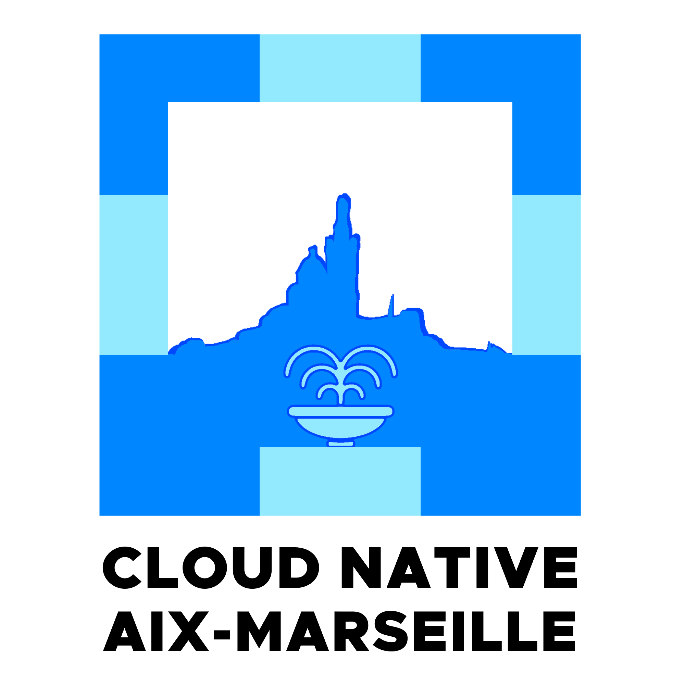

# Cloud Native Aix-Marseille 🚀

  

---

Bienvenue sur la page officielle de l'organisation **Cloud Native Aix-Marseille** ! 🎉

## Description

🚀 Cloud-Native Aix-Marseille

Vous êtes passionné par le Cloud-Native, le DevOps, l’infra ou l’agilité ? Rejoignez notre communauté tech à Aix-Marseille pour apprendre, partager et networker !

📌 Ce que nous proposons :

- ✅ Meetups mensuels à Aix ou Marseille
- ✅ Talks, workshops & REX sur Kubernetes, CI/CD, IaC…
- ✅ Échanges entre pros & passionnés

📌 Contribuez à la communauté :

- 🎤 [Proposez un talk](https://conference-hall.io/meetup-cloud-native-aix-marseille)
- 🤝 [Sponsorisez le meetup](https://community.cncf.io/cloud-native-aix-marseille)
- 🔗 [Inscrivez-vous](https://www.meetup.com/cloud-native-aix-marseille)

## 📅 Nos meetups

Chaque mois, nous proposons une rencontre conviviale où vous pourrez :

- Découvrir des outils et technologies comme Kubernetes, Docker, Terraform, CI/CD, etc.
- Explorer les méthodologies et bonnes pratiques DevOps.
- Partager des retours d’expérience concrets issus de la communauté.
- Networker avec d'autres passionnés dans une ambiance décontractée.

**🗓️ [Dates à venir](https://www.cloudnative.aixmarseille.tech/events)**

## 💡 Pourquoi cette page ?

Cette page sert à centraliser toutes les informations clés du groupe, notamment :

- Les **présentations** et ressources des meetups passés.
- Des liens vers des projets open source ou des outils partagés par la communauté.
- Les discussions et collaborations autour de projets DevOps.

N’hésitez pas à explorer notre dépôt GitHub pour en savoir plus et à contribuer si vous avez des idées à partager !

## 🧑‍💻 Rejoignez-nous !

Que vous soyez débutant, expert ou simplement curieux, notre communauté est ouverte à tous. Retrouvez-nous ici :

- **Site Web**: <https://www.cloudnative.aixmarseille.tech>
- **Code de conduite**: <https://www.cloudnative.aixmarseille.tech/code-of-conduct>

### Réseaux sociaux

Venez échanger avec nous et enrichir la culture Cloud Native & DevOps dans la région Aix-Marseille ! 🚀

- **Page Meetup** : <https://www.meetup.com/cloud-native-aix-marseille>
- **CNCF community**: <https://community.cncf.io/cloud-native-aix-marseille>
- **Conference Hall**: <https://conference-hall.io/meetup-cloud-native-aix-marseille>
- **LinkedIn**: <https://www.linkedin.com/company/cloud-native-aix-marseille>
- **Slack**: <https://openbar-community.slack.com/ssb/redirect>

### Autres ressources

- **GitHub** : <https://github.com/cloud-native-aixmarseille>
- **Branding** : <https://www.cloudnative.aixmarseille.tech/branding>
