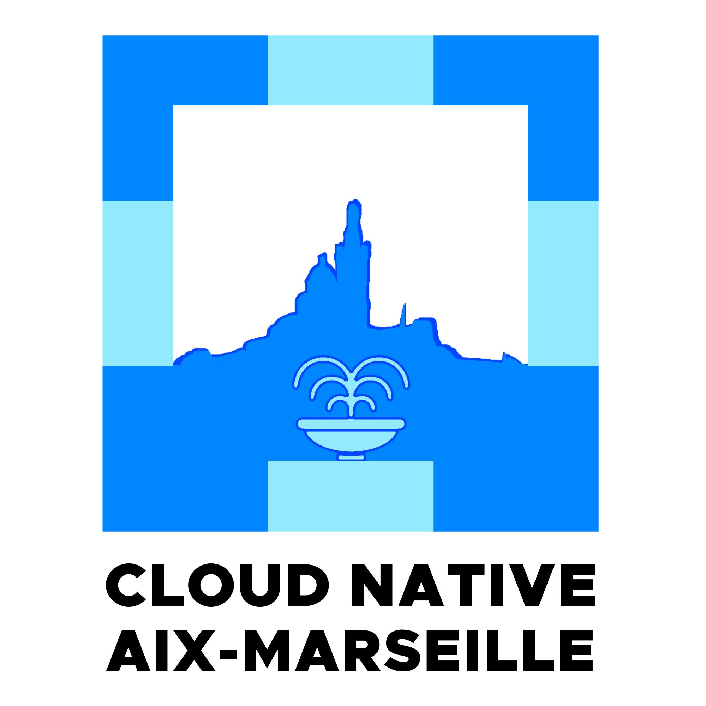

# Longer description

🚀 Bienvenue au Meetup Cloud-Native Aix-Marseille !

Vous êtes passionné par le Cloud-Native, le DevOps, l'infrastructure, le développement ou l'agilité ? Notre communauté dynamique rassemble des professionnels et des passionnés de la région Aix-Marseille et au-delà, désireux de partager, apprendre et innover ensemble.

## 🎯 Nos objectifs

- Apprentissage continu : À travers des conférences, des ateliers pratiques et des retours d'expérience, nous explorons les dernières tendances et technologies de l'écosystème Cloud-Native.
- Partage d'expériences : Nos membres présentent des cas concrets, des succès et des défis rencontrés, offrant une vision authentique du terrain.
- Networking : Profitez de nos rencontres pour élargir votre réseau professionnel, échanger avec des experts du domaine et découvrir de nouvelles opportunités.

## 🤝 Pourquoi nous rejoindre ?

- Événements réguliers : Nous organisons des meetups mensuels, alternant entre Aix-en-Provence et Marseille, pour rester connectés et informés.
- Diversité des sujets : De Kubernetes à la CI/CD, en passant par l'infrastructure as code et les méthodologies agiles, nos thématiques sont variées et actuelles.
- Communauté engagée : Rejoignez un groupe de professionnels motivés, prêts à partager leurs connaissances et à soutenir les initiatives locales.

##  🫶 Comment participer ?

- Assister aux événements : Inscrivez-vous à nos prochains meetups pour apprendre et échanger.
- Proposer une présentation : Vous avez une expertise ou un retour d'expérience à partager ? Soumettez votre proposition !
- Devenir sponsor : Soutenez la communauté tout en gagnant en visibilité auprès d'un public ciblé.
- Rejoignez-nous et contribuez à façonner l'avenir du Cloud-Native dans la région Aix-Marseille !
