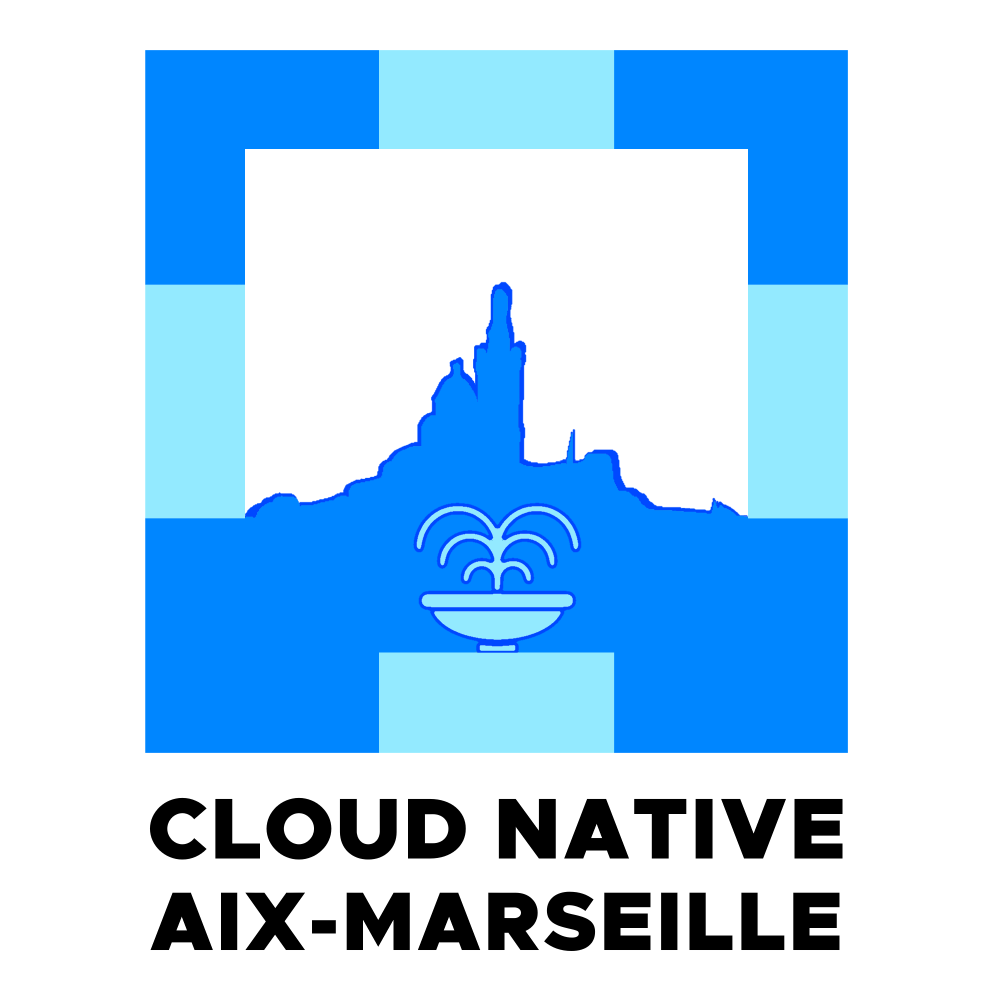

# Meetup Cloud Native Aix-Marseille 🚀

Bienvenue sur la page officielle du Meetup **Cloud Native Aix-Marseille** ! 🎉

## Description

🚀 Cloud-Native Aix-Marseille

Vous êtes passionné par le Cloud-Native, le DevOps, l’infra ou l’agilité ? Rejoignez notre communauté tech à Aix-Marseille pour apprendre, partager et networker !

📌 Ce qu’on propose :
  ✅ Meetups mensuels à Aix ou Marseille
  ✅ Talks, workshops & REX sur Kubernetes, CI/CD, IaC…
  ✅ Échanges entre pros & passionnés

🎤 Vous voulez intervenir ? Proposez un talk !
🤝 Sponsoriser ? Soutenez la communauté !
🔗 Inscrivez-vous & restez connectés !

## 📅 Nos meetups

Chaque mois, nous proposons une rencontre conviviale où vous pourrez :

- Découvrir des outils et technologies comme Kubernetes, Docker, Terraform, CI/CD, etc.
- Explorer les méthodologies et bonnes pratiques DevOps.
- Partager des retours d’expérience concrets issus de la communauté.
- Networker avec d'autres passionnés dans une ambiance décontractée.

## 💡 Pourquoi cette page ?

Cette page sert à centraliser toutes les informations clés du groupe, notamment :

- Les **présentations** et ressources des meetups passés.
- Des liens vers des projets open source ou des outils partagés par la communauté.
- Les discussions et collaborations autour de projets DevOps.

N’hésitez pas à explorer notre dépôt GitHub pour en savoir plus et à contribuer si vous avez des idées à partager !

## 🧑‍💻 Rejoignez-nous !

Que vous soyez débutant, expert ou simplement curieux, notre communauté est ouverte à tous. Retrouvez-nous ici :

- **Page Meetup** : [https://www.meetup.com/fr-FR/devops-aix-marseille/](https://www.meetup.com/fr-FR/devops-aix-marseille/)
- **GitHub** : [https://github.com/meetup-devops-aix-marseille](https://github.com/meetup-devops-aix-marseille)

Venez échanger avec nous et enrichir la culture Cloud Native & DevOps dans la région Aix-Marseille ! 🚀
